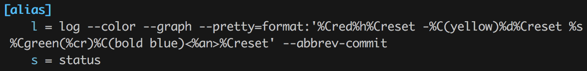

# Git auto-complete and alias

그동안 터미널에서 git을 쓰다보면 자동완성이 제공되지 않아 불편함을 느꼈다. jongrib님의 소개로 git auto-complete을 알게 되었고 그 setting 방법을 정리하려고 한다.

## Auto-complete

Mac OS 기준이며 homebrew는 설치되어 있다고 가정하고 작성했다.

1. `brew install git bash-completion`
2. 아래 명령어로 https://github.com/git/git/blob/master/contrib/completion/git-completion.bash 를 다운받는다.  
`curl https://raw.githubusercontent.com/git/git/master/contrib/completion/git-completion.bash > ~/.git-completion.bash`
3. `.bashrc` 파일에 다음을 추가한다.  
`source ~/git-completion.bash`

레퍼런스는 [여기](https://git-scm.com/book/ko/v1/Git%EC%9D%98-%EA%B8%B0%EC%B4%88-%ED%8C%81%EA%B3%BC-%ED%8A%B8%EB%A6%AD)있다.

## Alias

git에 익숙하지 않다면 명령어들이 길거나 복잡하여 어려움을 겪기 십상이다. 이때 git config를 사용하여 각 명령의 Alias을 쉽게 만들 수 있다. 아래는 Alias을 만드는 예이다.

```bash  
$ git config --global alias.co checkout  
$ git config --global alias.br branch  
$ git config --global alias.ci commit  
$ git config --global alias.st status  
```

또는 .gitconfig 파일에서 alias를 만드는 방법도 있다.


	
레퍼런스는 [여기](https://git-scm.com/book/ko/v1/Git%EC%9D%98-%EA%B8%B0%EC%B4%88-%ED%8C%81%EA%B3%BC-%ED%8A%B8%EB%A6%AD)있다.

