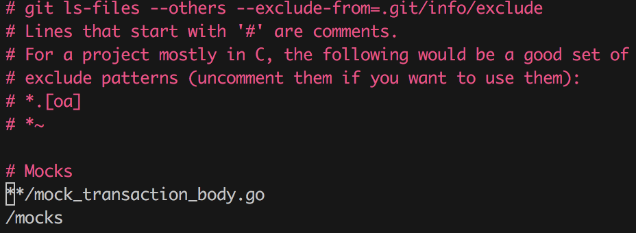

# Excluding files from git tracking

어떤 파일을 git에 포함되지 않도록 하는 방법에는 몇가지가 있다.
대표적으로 `.gitignore` 에 명시하여 tracking 하지 않도록 하는 방법이 있는데
이번에는 다른 방법을 얘기해보려고 한다.

git으로 버전관리되고 있는 path에서  `.git/info/exclude`라는 file이 있다.
`.gitignore`와 같은 방법으로 디렉토리나 파일을 여기에 명시해주면 git에서 untracking 된다.

 

그렇다면 `.gitignore`와 다른 점이 무엇일까?

먼저 `.gitignore` 방법의 경우 그 파일 자체가 git tracking 되고 프로젝트의 협업하는 모든 개발자들이 그 파일의 영향을 받게된다.
한편 로컬에서 특정 파일 또는 디렉토리를 untracking 하고 싶다면 위에서 이야기한 대로 
`.git/info/exclude`에 추가하면 된다.

[Reference](https://mylko72.gitbooks.io/git/content/commit/ignore.html)
