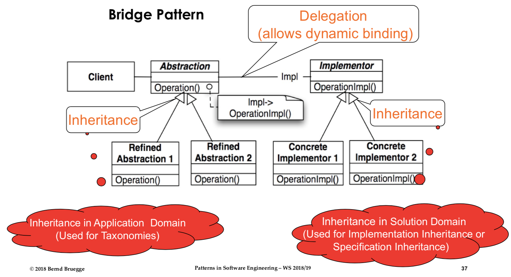
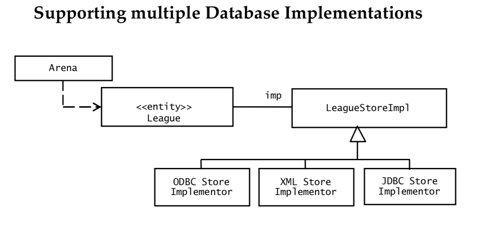
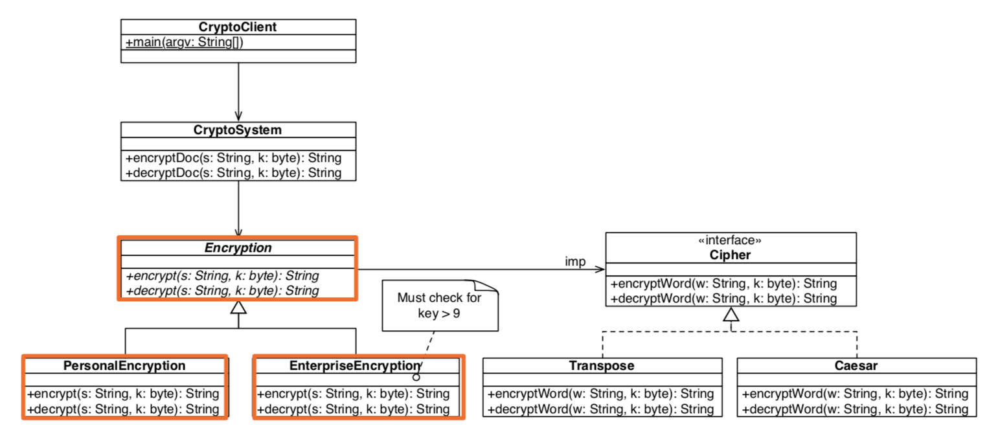

# Bridge Pattern

Bridge 를 떠올려보자. 
일반적으로 다리는 (강 건너) 떨어져 있는 두 지점을 연결해 주는 역할을 한다.

Bridge 패턴 역시 이러한 기능을 한다.
바로 **Abstraction**과 **Implementor**를 이어주는 것이다.


	
그렇다면 이 패턴이 필요한 때는 언제일까?
가장 먼저 떠오르는 것은 unit testing 할 때 Mock Object를 쓰는 것이다.
이 뿐 아니라 Client에 따라 old algorithm을 쓸 것인지, modern algorithm을 쓸 것인지 다른 algorithm을 지원해야 할 때 유용하다.
또한 다수의 database를 지원해야 할 때도 이 패턴을 적용할 수 있다.



그것은 바로 Bridge 패턴에서는 design decision을 시스템이 시작할 때까지 미룰 수 있기 때문이다. 
(Interface와 implementation 을 시스템이 시작할 때 implementation class의 constructor에서 연결해주면 되기 때문이다.)

## Example(java)

문서를 암호화하는 application을 개발한다고 하자.
개인 고객과 기업 고객이 있으며 client에 따라 다른 방식(Transpose, Caesar)의 암호화 방식을 지원한다.



먼저 Encryption abstract class를 만들어 주자.
	
Encryption.java

``` java
public abstract class Encryption {
	public abstract String encrypt(String w, byte k) ;
	public abstract String decrypt(String w, byte k) ;
}
```

다음으로 implementor인 Cipher class를 만들어 주자.

Cipher.java
``` java
public interface Cipher {
	public String encryptWord(String w, byte k);
	public String decryptWord(String w, byte k);
}
```

이제 Delegation을 통해 Implementor인 Cipher class와 dynamic binding 해준다.
(이게 바로 abstraction과 implementor 사이의 **Bridge**다!)

Encryption.java

``` java
public abstract class Encryption {
	protected Cipher imp;
	
	public abstract String encrypt(String w, byte k) ;
	public abstract String decrypt(String w, byte k) ;
}
```

다음으로 application domain의 taxonomy를 정의해 주자.
상속(inheritance)을 이용해 PersonalEcryption, EnterpriseEncryption 클래스를 정의한다.

PersonalEncryption.java

``` java
public class PersonalEncryption extends Encryption{
	
	public PersonalEncryption() {
		imp = new Transpose();
	}
	
	@Override
	public String encrypt(String w, byte k) {
		...
	}
	
	@Override
	public String decrypt(String w, byte k) {
		...
	}
}

```

EnterpriseEncryption.java

``` java
public class EnterpriseEncryption extends Encryption{
	
	public EnterpriseEncryption() {
		imp = new Caesar();
	}
	
	@Override
	public String encrypt(String w, byte k) {
		...
	}
	
	@Override
	public String decrypt(String w, byte k) {
		...
	}
}

```

나머지 concrete implementor인 Transpose와 Caesar를 구현해 주자.

Transpose.java

``` java
public class Transpose implements Cipher {

	public String encryptWord(String w, byte k) {
		...
	}

	public String decryptWord(String w, byte k) {
		...
	}

	private String reverse(String w) {
		...
	}
}
```

Caesar.java

``` java
public class Caesar implements Cipher {

	public String encryptWord(String w, byte k) {
		...
	}

	public String decryptWord(String w, byte k) {
		... 
	}
}
```

## Comparison between Adapter and Bridge pattern

공통점

- 두 패턴 모두 구현을 숨기고 있다.

차이점

- adapter pattern 이 완전히 다른, 관련이 없는 두 component 들이 같이 동작할 수 있게 해준다면,
- bridge pattern은 abstraction과 implementation을 서로 다르게, 독립적으로 디자인 할 수 있도록 해준다.

# Reference

Design Pattern I, Patterns in Software Engineering, Bernd Bruegge, W 18/19
