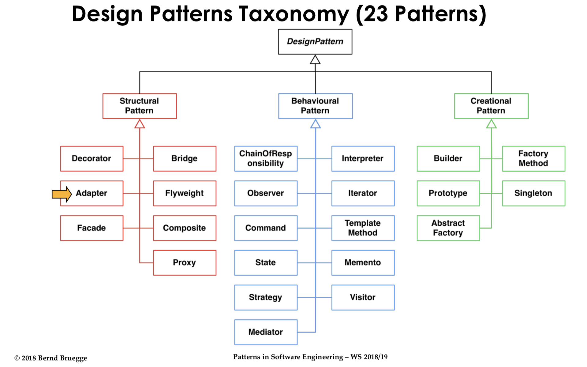
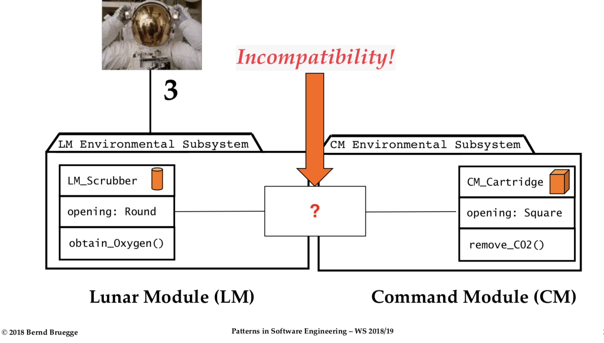
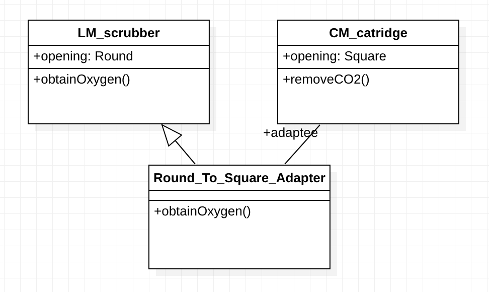
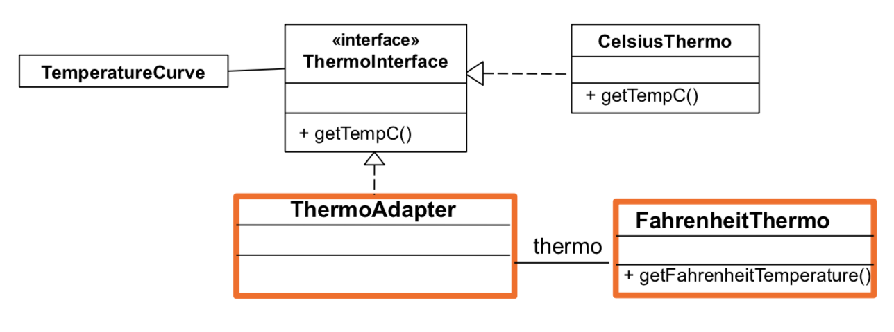

Adapter pattern 부터 시작해서 앞으로 배운 design pattern들의 특징, 장점, 사용 예(java 및 uml)를 정리하려고 합니다.
이에 앞서 왜 Design pattern을 적용해야 하며 그 종류에는 어떤 것들이 있는지 알아보겠습니다.

## Why do we need to learn design pattern?

- 디자인 패턴은 기존 시스템들의 설계 방식을 일반화한 결과물이다.
- 디자인 패턴을 익힘으로서 디자이너(개발자) 사이의 의사소통을 원활하게 할 수 있다.
- 재사용 가능한 코드를 작성할 수 있게 도와줍니다.
- 기존 코드의 문제점에 대해서 검증된 방법으로 해결 방안을 찾을 수 있기 때문에 효율적으로 코드를 개선할 수 있다. 

## 3 Types of Design Pattern(from "GoF Patterns")

- Structural pattern
	- 두 개 이상의 클래스들 사이의 coupling을 줄여 준다.
	- 앞으로의 확장을 위해 추상 클래스를 도입한다.
	- 복잡한 구조를 감싼다.(Encapsulation)
- Behavioral pattern
	- 복잡한 control flow를 간단하게 해준다.
- Creational pattern
	- 객체의 생성, 구성, 표현으로부터 시스템을 자유롭게(독립시켜) 준다.



# Adapter pattern

## Characteristics

어댑터 패턴은 *wrapper*로 불리기도 한다.
이미 존재하는 component의 인터페이스를 다른 인터페이스로 바꿔주는 역할을 한다.
마치 현실에서 사용하는 110V-220V 어댑터가 하는 역할과 비슷하다고 볼 수 있다.

어댑터 패턴을 이용함으로써 이미 있는 코드를 재사용할 수 있다.
이 때문에 Legacy system을 reengineer 할 때 매우 유용하다.
Legacy system에 접근할 수 있도록 새로운 인터페이스를 제공한다.
또한 양립할 수 없는 두 component를 connect 해준다.

## Example(in real world)

**Houston, we've had a problem!**

영화를 좋아하시는 분이라면 위의 대사를 한 번 쯤은 들어보셨을 거라고 생각합니다.
바로 아폴로 13호가 달의 궤도에 진입하려는 시점에서 산소탱크가 폭발하는 사고가 났던 것입니다.
조종사들은 Command module(사령선)을 폐쇄하고 Lunar module(달 착륙선)으로 이동하였습니다.
그러나, Lunar module은 애초에 조종사 2인을 위해 설계되어 물, 식량 뿐만 아니라 공급할 수 있는 산소량도 부족했습니다.
조종사들은 Command module에서 lithum hydrate catridge를 가져와 Lunar module의 Scrubber에 결합해 문제를 해결하려고 했습니다.
하지만 원형의 Lunar module의 scrubber에 사각형의 Command module의 catridge가 맞지 않는 새로운 난관에 봉착하게 됐습니다.



여기서 바로 adpater의 필요성이 드러나게 됩니다.



## Example(java)

문제 상황을 먼저 가정해 봅시다.

기온을 측정해서 *ThermoInterface*를 이용해 *ThermoCurve*로 보여주는 java로 잘 짜여진 시스템이 이미 있습니다.
이 *ThermoInterface*는 기온을 섭씨로 제공해 줍니다.

``` java
public class TemperatureCurve {

	public static void main(String[] args) {

		
		ThermoInterface thermo = new CelsiusThermo();
		//TODO: Replace the implementation of CelsiusThermo() with ThermoAdapter. 
		
		
		DecimalFormat df = new DecimalFormat("#.#");

		for (int i = 0; i < 5; i++) {
			System.out.println(df.format(thermo.getTempC()));
		}

	}

}
```

``` java
public interface ThermoInterface {

	double getTempC(); // return Temp in Celsius

}
```

그런데 누군가가 섭씨 온도계를 파손시켰고 화씨 온도계만 남게 되었습니다.
이 때 **adater pattern**을 이용해 온도를 섭씨로 표현하도록 해봅시다.



먼저 *ThermoAdatper*는 *ThermoInterface* 인터페이스를 구현(Relization)해야 합니다.

``` java
public class ThermoAdapter implements ThermoInterface{

}
```

그리고 섭씨-화씨 온도 변환 공식에 따라 얻은 화씨온도 값을 `getTempC()`메소드로 변환해줍니다.

``` java
public class ThermoAdapter implements ThermoInterface{
	private FahrenheitThermo fThermo;
	
	public ThermoAdapter() {
		this.fThermo = new FahrenheitThermo();
	}
	
	public double getTempC() {
		double tempFahrenheit = fThermo.getFarenheitTemperature();
		return (tempFahrenheit - 32.0) * (5.0/9.0);
	}
}
```

이렇게 하면 화씨 온도계만 가지고도 *TemperatureCurve*에서 섭씨온도로 온도를 나타낼 수 있게됩니다.

# Conclusion

디자인 패턴 시리즈(?)의 첫 번째 주인공인 Adapter 패턴에 대해 정리해 봤습니다.
공부한 소감은 별 것 아니고, 간단한 것 같은데 만약 Legacy 시스템을 보수해야 한다고 했을 때 매우 powerful할 것 같다는 느낌을 받았습니다.
앞으로 그런 경우가 생기면 'Adapter 패턴이 있었지'하고 떠올릴 수 있을 것 같습니다.

# Reference

Design Pattern I, Patterns in Software Engineering, Bernd Bruegge, W 18/19
