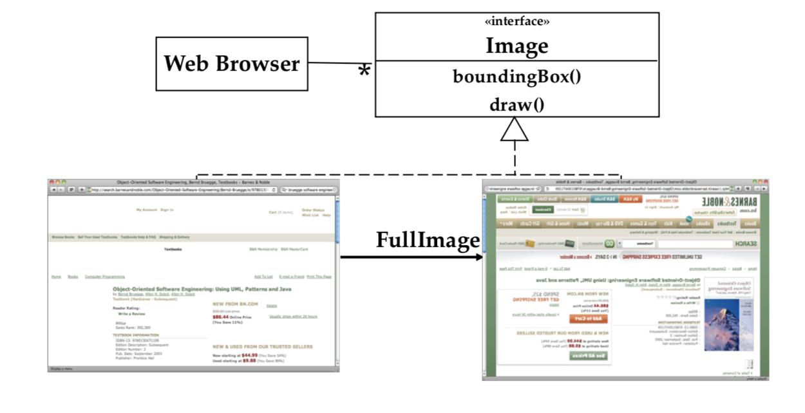
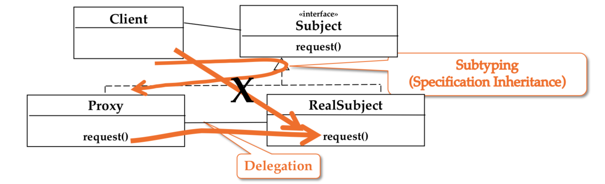
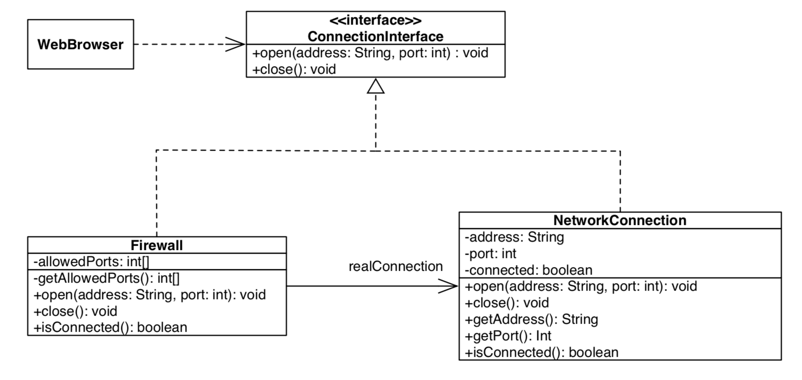

# Proxy pattern

브라우저에서 웹 페이지를 열려고 하는데 전송속도가 1 kB/sec 이라면 페이지에 있는 이미지를 로딩하는데 한 세월이 걸릴 것이다.
이 때 Dummy images 를 이용해 웹 페이지를 로드한다면 짧은 시간안에 페이지를 확인할 수 있다.



*ProxyImage*와 *RealImage* 모두 *Image* 인터페이스를 구현한다.

`draw()` operation은 Proxy와 Real에서 서로 다르게 구현된다.

- *ProxyImage*의 `draw()`는 항상 실행된다.
- *RealImage*의 `draw()`는 브라우저의 preference에 따라 호출될 수 있다.
- 브라우저는 Proxy와 Real중에 어떤것이 보여지고 있는지 알지 못한다.



Proxy와 RealSubject 모두Subject 인터페이스를 구현한다.
또한, Proxy의 `request()`는 RealSubject의 `request()`를 호출한다.
한편 클라이언트는 **절대로** RealSubject의 `request()`를 직접 호출하지 않고 Proxy의 `request()`를 통해 호출한다.

## Applicability of the Proxy pattern

- Caching(Remote Proxy)
	:proxy 객체가 다른 주소에 있는 객체의 local representative역할을 한다.(Caching of information)
	 - information이 자주 변하지 않는 경우 좋다.
	 - 변겨오디는 경우 cache를 flush해줘야 한다.
- Substitute(Virtual Proxy)
	: 객체를 생성하거나 download 하는 것이 부담스러울 때 proxy object가 실제 object를 대체하는 역할을 한다.
  - information에 즉시 접근이 어려울 때 좋다.
  - 예를 들어 Google Maps에서 이미지를 로딩할 때
- Access Control(Protection Proxy)
	: Proxy 객체가 실제 객체에 접근권한을 control하는 역할을 한다.
  - 같은 문서에 대해 객체별로 다른 접근 권한 또는 읽기 권한이 주어져야 할 때 유용하다.
  - 예를 들어 학생의 성적 정보를 관리자, 교사, 학생별로 볼 수 있는 권한을 다르게 한다.

## Example

현재 NetworkConnection 객체를 통해 네트워크에 연결하는 방법에 보안이슈를 해결하기 위해 proxy pattern을 적용해보기로 한다.
Firewall을 만들어 포트번호 80 또는 8080으로만 HTTP connection이 가능하도록 하자.



이미 구현되어 있는 *ConnectionInterface*와 *NetworkConnection*코드이다.

ConnectionInterface.java

``` java
public interface ConnectionInterface {	
	public void open(String address, int port);
	public void close();
}
```

NetworkConnection.java

```java
public class NetworkConnection implements ConnectionInterface {
	private String address;
	private int port;
	private boolean connected;	

	@Override
	public void open(String address, int port) {
		...
	}
	
	@Override
	public void close() {
		...
	}
	
	private void openConnection(){
		...
	}
	
	private void closeConnection(){
		...
	}

	...	
}
```

이제 Proxy pattern을 적용해보자.
앞서 다뤘듯이 proxy는 real 객체와 함께 SubjectInterface를 구현해야 한다.
또한, proxy를 통해 request를 할 수 있어야 한다.

Firewall.java

``` java
public class Firewall implements ConnectionInterface{
	private int[] allowedPorts;
	private NetworkConnection realConnection;

	public Firewall(int[] ports) {
		this.allowedPorts = ports;
		this.realConnection = new NetworkConnection();
	}

	public void open(String address, int port) {
		if(isAllowedPorts(port)) {
			realConnection.open(address, port);
			System.out.println("connection established");
		} else {
			throw new RuntimeException("connection rejected");
		}
	}

	public void close() {
		realConnection.close();
	}

	public int[] getAllowedPorts() {
		return this.allowedPorts;
	}

	public boolean isConnected() {
		return realConnection.isConnected();
	}
}
```

## Conclusion

시간이 많이 소요되는 복잡한 객체를 생성하는 시간을 Proxy 객체로 줄일 수 있었다.
이외에도 Protection proxy등 다양한 용도로 이 패턴을 자주 사용할 수 있기 때문에 잘 숙지해야겠다.

## Reference

Design Pattern I, Patterns in Software Engineering, Bernd Bruegge, W 18/19

