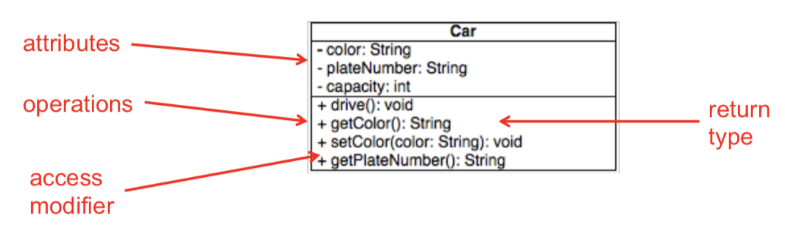
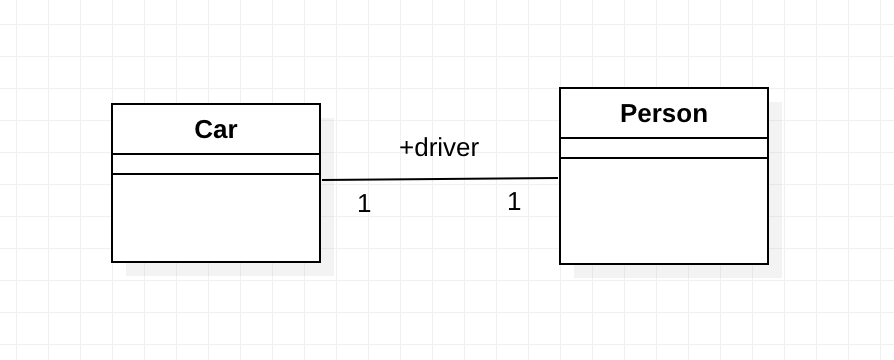
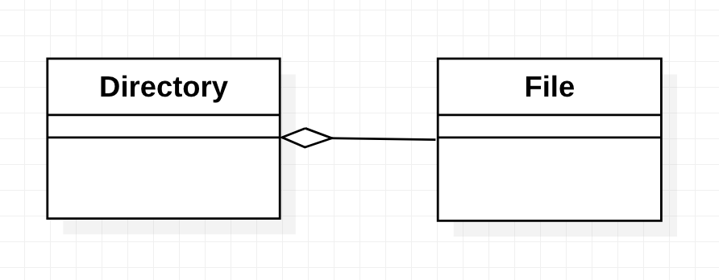
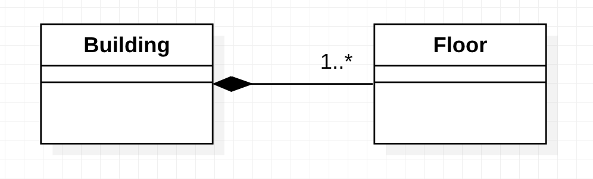
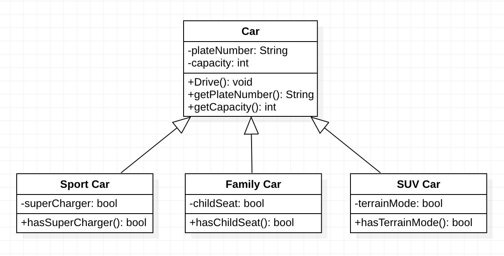
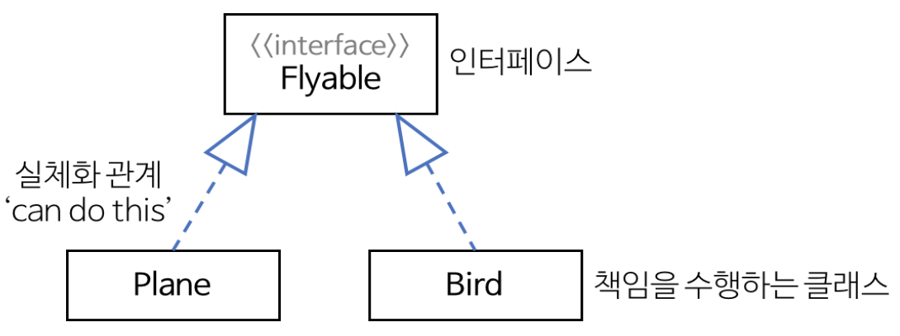

# UML Basic

UML. UML이 무엇일까? Pattern design 공부를 시작하면서 가장 처음 들었던 말이  Java와 UML이 기본이 된다는 것이었다.
Java는 객체지향 프로그래밍 언어니까 그러려니 했지만 UML이 무엇이길래 이 공부를 하는데 있어서 꼭 필요할까라는 생각이 들었다.
그래서 UML이 무엇인지, 어떻게 쓰는지 알아보게 되었다.

## Unified Modeling Language

처음에는 ML을 보고 HTML같은 Markup Language 일 것이라고 추측했지만 보기 좋게 빗나갔다.
그렇다. UML은 시스템을 모델로 표현해주는 모델링 언어이다.

## Class Diagram

시스템을 구성하는 클래스들 사이의 관계를 나타내주는 구조도

위의 그림에서 볼 수 있듯이 클래스를 나타내는 저 사각형 안에는 클래스 이름, attributes, operations가 들어간다.
가장 윗부분에는 클래스 이름을 적어준다.
그 아랫칸은 attributes를 위한 영역이다. 
각 attributes의 type과 access modifier를 명시해 준다.
맨 아랫칸에는 operation을 적어주는데 operation의 경우도 마찬가지로 access modifier를 명시해주며 parameter, return type까지 적어준다.

이렇게 클래스를 나타냈으면 다음은 이 클래스들을 연결해줄 차례다.

## Relationships in Class Diagram

- Association

	클래스 사이에 논리적 연결 또는 관계가 있음을 나타낸다. 이 관계는 단방향일 수도, 양방향일 수도 있다. 그리고 Association의 끝 부분은 이름을 가질 수 있다.
	- Multiplicity
	
		association의 끝 부분에는 multiplicity를 명시할 수 있는데 몇 개의 link가 가능한지 여부를 적는다.

		| | | 
		|:---:|----|
		0 | No intances
		0..1 | No instances, or one instance
		1 | Exactly one instance
		1..1 | Exactly one instance
		0.. \* | Zero or more instances
		\* | Zero or more instances
		1..* | One or more instances

		
	
- Aggregation

	part of, conmsists of, contains, hierarcies(계층구조)의 관계를 model할 때 사용된다.	
	한 객체가 다른 객체를 포함하는 것을 나타내며 아래의 composition 과 다르게 전체가 destroyed 되더라도 그 부분들은 살아남을 수 있다.
	또한, 부분 object를 다른 (전체)object와 공유할 수 있다.
	빈 마름모는 '전체'클래스 쪽에 그린다.

	

- Composition

	부분이 전체로부터 독립적으로 존재할 수 없는 관계를 표현한다. 만약 전체가 destroyed 되면, 부분도 destroyed 된다.
	선을 그릴 때 색칠한 마름모가 전체 쪽으로 향하도록 그린다.

	

- Inheritance
	- Generalization

	하위(자식)클래스를 generalize 한 것이 상위(부모)클래스이다. 
	이 때는 화살표를 그릴 때, 화살표가 부모클래스를 향하도록 그린다.

	

	- Implementation
	
	Interface란 타입의 behavior에 대한 abstract specification 이다. 어떤 object가 해야 하는 일 또는 할 수 있는 일을 외부에 제공한다.
	interface 에서는 직접적으로 operation을 구현하지 않으며 다른 클래스에서 구현한다.
	이 interface-implementation(realization) 관계를 UML에서는 점선+빈 삼각형 화살표로 나타낸다.

	

### Reference

[Heejeong Kwon 님의 github io](https://gmlwjd9405.github.io/2018/07/04/class-diagram.html)

*Object Oriented Concpets Revisited*, Patterns in Software Enginnering
