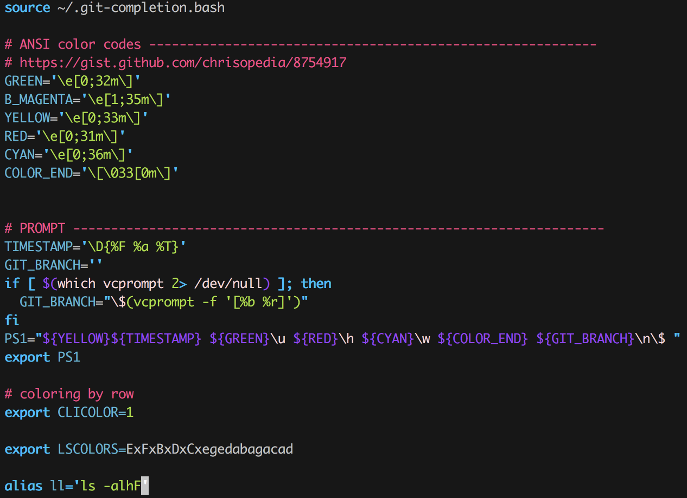
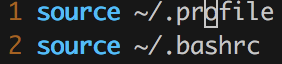
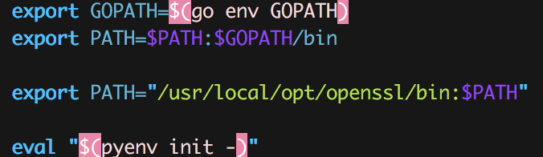

# Difference of .bashrc, .bash\_profile and \_profile

iTerm을 이용하여 개발을 하다보니 각종 환경을 setting 할 일이 많이 생겼다.
매번 `.bashrc`, `.bash_profile`, `.profile` 파일을 건드려서 수정했었는데 이번 기회에 각 파일들의 역할이 무엇인지, 어떻게 동작하는지 알아보려고 한다.

그 전에 **Login Shell** 과 **Non-Login Shell**의 차이부터 짚고 넘어가자.

## Login Shell Vs Non-Login Shell

Login Shell은 계정과 암호를 입력해서 shell을 실행하는 것을 말합니다. 
ssh로 접속하거나 로컬에서 GUI를 통해 실행하는 것이 여기에 속합니다.

`.profile`, `.bash_profile` 두 파일은 로그인 할 때 로드되는 파일입니다. 
`.profile`은 꼭 bash가 아니더라도 로그인 하면 로드되며 `.bash_profile`은 꼭 bash로 로그인 할 때만 실행됩니다.

Non-Login Shell은 로그인 없이 실행하는 shell입니다.

## .bashrc / .bash\_profile / \_profile
- .bashrc : Non-Login shell에서 실행되며 이미 로그인한 상태에서 새 터미널을 열 때 마다 실행된다.

- .bash\_profile: Login Shell에서 실행되며 시스템에 로그인할 때 마다 실행된다.

- .\_profile: 로그인할 때 로드되며 bash와 관계없는 것들을 여기에 넣는다.

[Reference](http://uroa.tistory.com/114)
