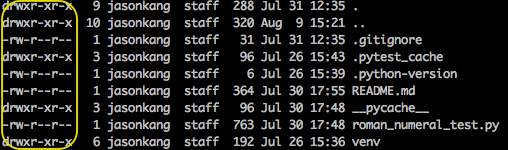

# Unix Permission

파일 또는 디렉토리를 다룰 수 있는 권한을 의미한다. 시스템에 접속하는 사용자들이 파일에 접근을 허가하거나 금지하기 위해 설정이 필요하다.

permission은 8진수 또는 r, w, x의 문자로 표현 가능하다. 각 문자의 의미는 아래와 같다.

- **r** 읽기(4). 파일을 열어 볼 수 있으며 복사 가능하다.
- **w** 쓰기(2). 파일에 덧붙여 쓸 수 있다. 읽기와 쓰기 권한을 동시에 가졌으면 파일을 편집할 수 있다.
- **x** 실행(1). 프로그램 파일이나 쉘스크립트 파일, perl 같은 인터프리터 프로그래밍 언어로 작성된 파일에 부여

예를 들어 `-rwxr-xr-x` 이면 소유자는 모든 권한을 가지고, 그룹과 기타 사용자는 읽기 및 실행 권한을 가진다.

한편, 8진수로 표현할 때는 권한의 합으로 표시한다. 예를 들어 읽기(4)와 쓰기(2) 권한이 모두 있다면 4 + 2 = 6 이 된다.

0644는 0600, 040, 04 를 더한 값으로 이 파일에 대한 소유자는 읽기와 쓰기, 그룹과 기타 사용자는 읽기 권한이 있음을 의미한다.

