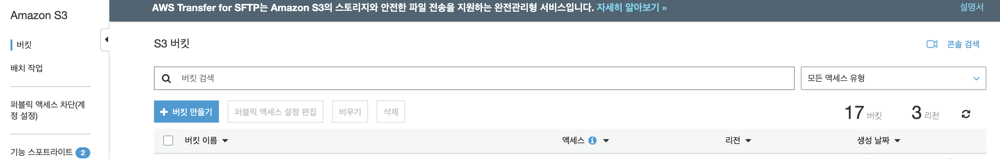
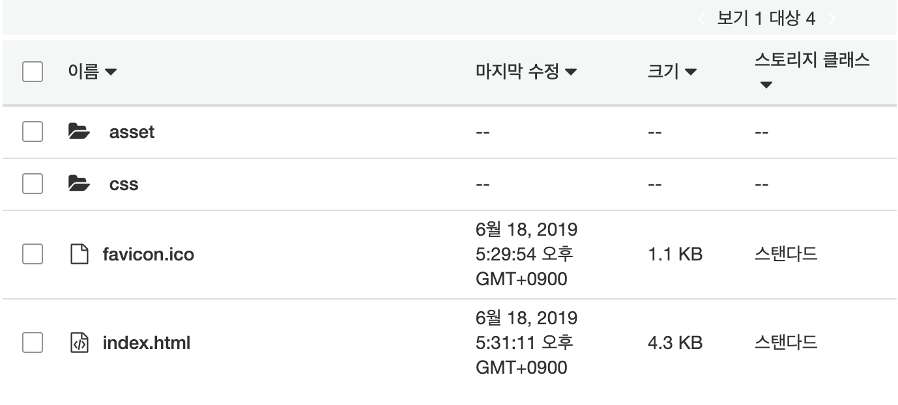
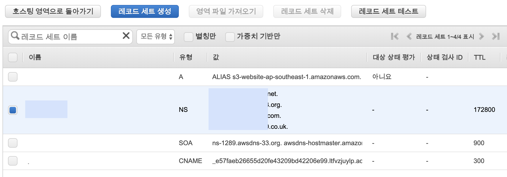

# Web hosting with AWS S3

 HTML, CSS, Javascript를 이용해 제작한 정적 웹페이지 만들기를 완성했다면 그 다음은 이를 호스팅할 차례이다.
 그것을 위해서 어떤 작업들이 필요한지 정리해보았다.

 - [Create AWS S3 bucket and upload files](#create-aws-s3-bucket-and-upload-files)
 - [Purchase private domain](#purchase-private-domain) 
 - [Connect domain and bucket with AWS route 53](#connect-domain-and-bucket-with-aws-route-53)
 - [Distribute with AWS cloudfront](#distribute-with-aws-cloudfront)

# Create AWS S3 bucket and upload files

Amazon Simple Storage Service(Amazon S3)는 인터넷 상에 있는 스토리지다. 
Amazon S3를 사용하면 웹을 통해 언제 어디서든 원하는 양의 데이터를 저장하고 검색할 수 있다. 

AWS S3 콘솔에 접속하여 우측 상단에 **버킷 만들기** 버튼을 클릭한다.



버킷 이름과 리전을 입력한다.
버킷 이름은 호스팅할 웹 페이지 이름으로 입력한다.

버킷을 생성했다면 그 다음 할 일은 HTML, CSS, javascript 파일 등을 업로드하는 것이다.



HTML 에 포함된 image등 리소스는 asset, css stylesheet 는 css directory에 위치시켰으며, 루트 디렉토리에 index.html과 favicon을 위치시켰다.

파일 업로드를 완료했다면, 그 다음은 Bucket Permisson을 설정할 차례이다.
현재는 업로드한 자신 말고는 다른 사용자들이 resource를 볼 수 없다.

상단에 **권한**> **버킷 정책**의 버킷 정책 편집기를 통해 버킷 정책을 update 할 수 있다.
코드 박스 아래 정책 생성기가 있으니 활용하도록 하자.
내 버킷의 권한 설정은 아래와 같다.

``` json
{
    "Version": "2012-10-17",
    "Id": "Policy1560084240683",
    "Statement": [
        {
            "Sid": "Stmt1560084238530",
            "Effect": "Allow",
            "Principal": "*",
            "Action": "s3:GetObject",
            "Resource": "arn:aws:s3:::_my_domain.com/*"
        }
    ]
}
```

마지막으로, 버킷의 정적 웹 사이트 호스팅 기능을 활성화 해주어야 s3에서의 설정이 끝나게 된다.
이는 상단 탭 속성 > 정적 웹 사이트 호스팅을 통해 할 수 있다.

# Purchase private domain 

위와 같이 s3에 버킷을 생성하고, 파일을 업로드하고 설정까지 마무리 해주면 드디어 제작한 정적 웹페이지를 브라우저를 통해 접속할 수 있다.
그러나 아래와 같이 복잡한 URL을 이용해 access해야 한다.

```
<bucket-name>.s3-website-<AWS-region>.amazonaws.com
```
 
원하는 고유의 도메인을 사용하기 위해서는 도메인 사업자(후이즈, 가비아, AWS route 53등)를 통해 도메인을 구매해야 한다.
도메인의 가격은 유형별로 차이가 크기 떄문에 신중히 고민한 후 구매할 필요가 있다.

# Connect domain and bucket with AWS route 53
 
도메인을 구매했으면 이제 정적 웹페이지 소스들을 보관하고 있는 s3 버킷과 연결해줄 차례이다.

AWS route 53 이란, Amazon Route 53는 가용성과 확장성이 우수한 도메인 이름 시스템(DNS), 도메인 이름 등록, 상태 확인 웹 서비스다. 
	
AWS route 53 management console에 접속 후 우측 상단의 *호스팅 영역 생성* 버튼을 눌러 새로운 호스팅 영역을 만든다.
생성할 때에는 도메인 이름과 간단한 설명을 입력하면 된다.

호스팅 영역이 생성되었다면 NS, 즉 네임서버 레코드가 생성된다.
DNS 사업자 (후이즈 또는 가비아) 서비스에서 네임서버 정보를 이 레코드로 변경하면, 도메인 연결 작업은 끝이다.



# Distribute with AWS cloudfront

AWS cloudfront 란 Amazon CloudFront는 .html, .css, .js 및 이미지 파일과 같은 정적 및 동적 웹 콘텐츠를 사용자에게 더 빨리 배포하도록 지원하는 웹 서비스다. 
CloudFront는 엣지 위치라고 하는 데이터 센터의 전 세계 네트워크를 통해 콘텐츠를 제공한다.

본인의 경우 s3 버킷의 region을 Singapore에 두어 서울에서 접속하려고 하면 페이지를 로드하는데 꽤 오랜 시간이 걸린다.
이와 같이 다른 리전에서 이미지 또는 동영상 소스가 많은 웹 페이지를 열려고 하면 소요시간은 길어질 수 밖에 없다.
글로벌 서비스 웹 페이지를 만든다고 하면 이 이슈를 어떻게든 해결하여야 하는데, AWS cloudfront가 충분히 그 solution이 될 수 있다.

AWS Cloudfront management console에서 우측 상단의 create distribution 버튼을 클릭한다.
Web 전송방식을 선택하고 S3를 origin으로 사용하는 배포를 생성한다. 

Origin setting 에서 Origin Domain Name은 오리진의 도메인 이름을 설정하는 부분으로 현재 사용가능한 S3 버킷과 ELB목록을 볼 수 있다.
Restrict Bucket Access 를 Yes로 setting하면 S3 버킷에 Cloudfront만 접근할 수 있게 해준다.
나머지 세부 설정까지 해준 다음 **create distribution** 버튼을 누르면 Cloudfront 배포가 생성되며, 모든 에지 로케이션에 전파되기까지 15-20분 가량 소요된다.
모든 에지 로케이션까지 전파되면 management console에서 상태가 In Progress에서 Deployed로 변경된다.

